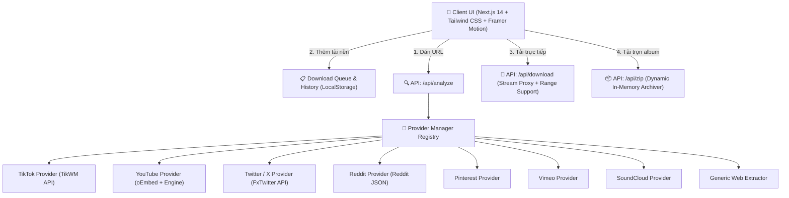

# MediaHub Downloader 🚀

<div align="center">


**Trình phân tích và tải xuống Media đa nền tảng tối tân — Nhanh chóng, Không Watermark, Chuẩn bản quyền.**

[](https://nextjs.org/)
[](https://www.typescriptlang.org/)
[](https://tailwindcss.com/)
[](https://www.framer.com/motion/)
[](LICENSE)

[Tính năng](#-tính-năng-chính) • [Nền tảng hỗ trợ](#-ma-trận-nền-tảng-hỗ-trợ) • [Cài đặt](#-cài-đặt--chạy-local) • [Triển khai](#-triển-khai-online) • [Tài liệu API](#-tài-liệu-api-cho-developer) • [Bản quyền](#-chính-sách-bản-quyền--drm)

</div>

---

## 🌟 Tính năng chính

- ⚡ **Tự động nhận diện URL**: Nhận dạng thông minh giao thức và icon nền tảng ngay khi người dùng gõ hoặc dán link.
- 🎯 **Tải không logo / Watermark**: Trích xuất video Full HD 1080p nguyên bản không dính watermark từ TikTok, Twitter/X, v.v.
- 📦 **Đóng gói Album ZIP động**: Hỗ trợ bài đăng nhiều ảnh (TikTok carousel, Reddit gallery, Twitter multi-photos), cho phép chọn từng ảnh hoặc tải toàn bộ thành file `.zip` trực tiếp.
- 🏷️ **Đặt tên file chuẩn xác**: Tự động đặt tên theo cấu trúc:  
  `[nền_tảng]_[id_bài_đăng]_[username]_[tiêu_đề].[phần_mở_rộng]`  
  *(Ví dụ: `tiktok_7106594312292453678_khaby.lame_video.mp4`)*
- 🎬 **Trình phát Preview trực tiếp**: Tích hợp video/audio player HTML5 xem trước nội dung trước khi quyết định tải.
- 🚀 **Tải tăng tốc đa luồng**: API streaming hỗ trợ `HTTP Range / 206 Partial Content` giúp tải song song nhiều luồng, không chiếm dụng RAM thiết bị.
- 📋 **Hàng đợi & Lịch sử tải**: Quản lý Download Queue với tiến trình % thời gian thực; lưu trữ lịch sử tải an toàn 100% tại LocalStorage trình duyệt (có tính năng xuất/nhập file JSON).
- 🌙 **Giao diện Obsidian Glassmorphism**: Thiết kế Dark Mode phong cách Cyberpunk/Neon hiện đại, responsive hoàn hảo từ điện thoại đến máy tính.

---

## 📱 Ma trận nền tảng hỗ trợ

| Nền tảng | Định dạng hỗ trợ | Chất lượng tối đa | Tính năng đặc biệt |
| :--- | :--- | :--- | :--- |
| **TikTok** | Video (MP4), Audio (MP3), Album | 1080p Full HD | Không logo, tải ảnh album thành ZIP |
| **YouTube** | Video (MP4), Audio (MP3) | 1080p, 720p, 480p | Hỗ trợ Shorts, trích xuất ảnh thumbnail MaxRes |
| **Twitter / X** | Video (MP4), Ảnh (JPG) | 1080p HD | Tải trọn bộ ảnh đính kèm, multi-bitrate |
| **Reddit** | Video (MP4), Audio, Album | Native 1080p | Tải video kèm audio, hỗ trợ Reddit Gallery |
| **Instagram** | Video (MP4), Ảnh (JPG) | 1080p HD | Reels, bài đăng video công khai |
| **Facebook** | Video (MP4) | HD & SD | Facebook Watch, Reels công khai |
| **Pinterest** | Ảnh (JPG), Video (MP4) | Original Full HD | Tự động phân giải link rút gọn pin.it |
| **Vimeo** | Video (MP4) | 1080p Progressive | Luồng stream bitrate cao |
| **SoundCloud** | Audio (MP3), Artwork | High Bitrate | Tải bài hát kèm ảnh bìa gốc 500x500 |
| **Twitch** | Video (MP4) | 1080p60 FPS | Clips và VOD hoàn tất |
| **Universal Web**| Video, Audio, Ảnh | Original Source | Bóc tách OpenGraph, Twitter Cards & HTML5 |

---

## 🏗️ Kiến trúc hệ thống



---

## 💻 Cài đặt & Chạy Local

### 1. Yêu cầu hệ thống
- **Node.js**: Phiên bản 18.17.0 trở lên
- **NPM** hoặc **Yarn / PNPM**
- **Python 3.10+** (tùy chọn, để hỗ trợ yt-dlp cho YouTube/Facebook)

### 2. Các bước khởi chạy
```bash
# 1. Clone repository về máy tính
git clone https://github.com/<tai-khoan-cua-ban>/mediahub-downloader.git
cd mediahub-downloader

# 2. Cài đặt các gói phụ thuộc
npm install

# 3. Cài đặt yt-dlp (tùy chọn mở rộng cho universal engine)
python -m pip install yt-dlp

# 4. Khởi chạy server phát triển
npm run dev
```

Truy cập đường dẫn: **`http://localhost:3000`**

### 3. Lệnh biên dịch Production
```bash
# Kiểm tra lỗi cú pháp TypeScript
npx tsc --noEmit

# Build production bundle
npm run build

# Chạy server production
npm run start
```

---

## ☁️ Triển khai Online

Media Hub hiện chạy trên Cloudflare Workers tại [media.ducmanh.xyz](https://media.ducmanh.xyz/), không phụ thuộc Vercel. Domain và route được cấu hình trong `wrangler.jsonc`.

```bash
npm install
npm run build
npx wrangler deploy --config dist/server/wrangler.json
```

Cloudflare Workers không chạy được Python `yt-dlp`. Các luồng phân tích và tải bằng HTTP của từng provider vẫn hoạt động; đường fallback cần Python đã được vô hiệu hóa.

---

## 📡 Tài liệu API cho Developer

MediaHub cung cấp sẵn các REST endpoints:

### 1. Phân tích URL
- **Endpoint:** `POST /api/analyze`
- **Body:** `{ "url": "https://www.tiktok.com/@tiktok/video/7106594312292453678" }`
- **Ví dụ cURL:**
  ```bash
  curl -X POST https://your-domain.com/api/analyze \
    -H "Content-Type: application/json" \
    -d '{"url":"https://www.tiktok.com/@tiktok/video/7106594312292453678"}'
  ```

### 2. Tải Stream Proxy
- **Endpoint:** `GET /api/download?url={STREAM_URL}&filename={FILE_NAME}`
- Hỗ trợ header `Accept-Ranges: bytes` và `Content-Disposition`.

### 3. Đóng gói ZIP Album
- **Endpoint:** `POST /api/zip`
- **Body:**
  ```json
  {
    "items": [
      { "url": "https://example.com/1.jpg", "filename": "photo_1.jpg" },
      { "url": "https://example.com/2.jpg", "filename": "photo_2.jpg" }
    ],
    "zipName": "my_album"
  }
  ```

---

## ⚖️ Chính sách bản quyền & DRM

> **Tuyên bố trách nhiệm:**  
> MediaHub Downloader được tạo ra nhằm mục đích hỗ trợ tải xuống nội dung mà người dùng **có quyền hoặc được cấp phép** truy cập công khai. Ứng dụng **không hỗ trợ** và **không can thiệp** vào các cơ chế mã hóa bản quyền số (DRM như Widevine, FairPlay), không bẻ khóa nội dung tài khoản riêng tư hoặc nội dung trả phí.

---

## 📄 Giấy phép

Dự án được phát hành dưới giấy phép [MIT License](LICENSE).
